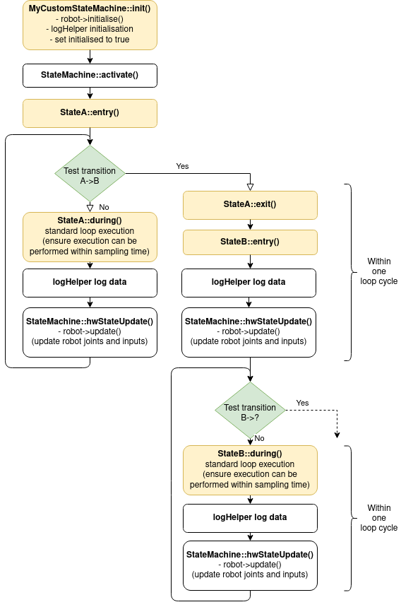

# Building a custom application (with a custom state machine)

Each CORC application is a dedicated state machine with its own states which have access to your specific robot.

(For information on migrating a StateMachine from the previous version of CORC (<2.0) to the new one, see [this PR](https://github.com/UniMelbHumanRoboticsLab/CANOpenRobotController/issues/51).)


## Setup

To create a custom application with custom state machine, two things must be done. 

First, the source code itself must be developed, by deriving the StateMachine class can be to a custom one, named `MyCustomStateMachine`, in files named `MyCustomStateMachine.h/cpp`. These must be placed in a dedicated subfolder with a consistent name (e.g. `MyCustomStateMachine` must be used for both the folder and the file names)

Secondly, CMakeLists.txt must be edited and the entry `set (STATE_MACHINE_NAME "ExoTestMachine")` changed to `set (STATE_MACHINE_NAME "MyCustomStateMachine")`. If the custom statemachine folder is placed outside of CORC `src/apps` folder, the path should be set in CMakeLists.txt using the command `set (STATE_MACHINE_PATH "../pathto/MyCustomStateMachine")`.

That's it, simply use the same build procedure.

> Note: It is recommended to use one of the existing application (X2DemoMachine or M3DemoMachine) as a template for your new state machine: simply copy the app folder closest to your application and follow the steps above.

> Note: Additionnal code can be placed in the state machine folder. Every file placed in this folder (and subfolders) named in {.c, .cpp, .h}  will be compiled.

> Note: It is recommended to place custom statemachine outside of the CORC folder to ease update and code versioning.


## State machine structure and custom states and transitions

CORC provides a structured way to build event driven Finite State Machines.

The execution flow of a typical state machine with two states A and B is shown on this diagram and detailed below.
   
   
   
Yellow parts highlights the methods which needs to be overriden with custom application code whereas Green blocks represents transitions that needs to be setup.

### States

Each state is a custom class, derived from the generic `State`. It contains three main methods which should be overidden to include your custom code:
- `virtual void entry()` which is called once when entering the state
- `virtual void during())` which is called repeatidly by the main control loop and which manage the normal control execution. The code within this state should be executable within less time than the sampling period.
- `virtual void exit()` which is called once when exiting the state (either by transition or when program ends).

For example the SittingDown class in the ExoTestmachine:

```C++
void SittingDwn::entry(void) {
    cout << " GREEN -> SIT DOWN " << endl
    trajectoryGenerator->initialiseTrajectory(SIT, 1);
    robot()->startNewTraj();
}
void SittingDwn::during(void) {
    robot()->moveThroughTraj();
}
void SittingDwn::exit(void) {
    std::cout << "Sitting Down State Exited " << endl;
}
```

> Note that you should ensure that the code within each of this method is deterministic and can be executed during one application loop period.

States objects to be used should then be defined in your state machine constructor and an initialisation State should be selected:
```C++
MyCustomStateMachine::MyCustomStateMachine() {
    setRobot(std::make_unique<X2Robot>()); //Create the robot object and assign it to the state machine

    addState("initState", std::make_shared<InitState>(robot(), trajectoryGenerator));
    addState("standing", std::make_shared<Standing>(robot(), trajectoryGenerator));
    addState("sitting", std::make_shared<Sitting>(robot(), trajectoryGenerator));
    
    ...
    
    setInitState("initState"); //Define which state to call at start of state machine. If omitted, the first added state is used.
}
```
> There is no theoretical limit on the number of states in a StateMachine.
> Multiple different states of the same State type can instantiated (and are effectively different states).
> States are refered to by their name (e.g. "standing") which must be unique and not empty.
> The order in which states are created does not matter (except to define the initial state if setInitState is not used).

### Events and transitions

Events are used to trigger transitions from one state to another. They could be based on a sensor trigger, timer, internale state...
Programmatically, CORC represents events as a callback function, taking the StateMachine as argument and returning a boolean. The function should return true when the transition(s) should happen.

To create a new event:
- Define it's trigger boolean method. For example:
```C++
bool startExo(StateMachine & SM) {
    ExoTestMachine & sm = static_cast<ExoTestMachine &>(SM); //Cast to specific StateMachine type

    if (sm.robot()->keyboard->getS() == true) {
        spdlog::info("LEAVING INIT and entering Sitting");
        return true;
    }
    return false;
}
```

Once events have been declared, they can be used to trigger transitions between states. This is done by adding a transition between state in the StateMachine constructor:
```C++
    addTransition("initState", &startExo, "standing");
    addTransition("initState", &startExoCal, "standing");
```
The first argument is the 'from' state, the second one is a reference to the event callback function and the third one is the destination ('to') state of the transition. Convenience methods `addTransitionFromLast` and `addTransitionFromAny` are also available to define transitions.

> Note that the same event can be used by multiple transitions. Multiple transitions (with different events) can also be used for the same state: the go to state being selected by the event being triggered.

Finally a complete state machine constructor look like:

```C++
MyCustomStateMachine::MyCustomStateMachine() {
    setRobot(std::make_unique<X2Robot>());

    // States creation
    addState("initState", std::make_shared<InitState>(robot(), trajectoryGenerator));
    addState("standing", std::make_shared<Standing>(robot(), trajectoryGenerator));
    addState("sitting", std::make_shared<Sitting>(robot(), trajectoryGenerator));
    addState("standingUp", std::make_shared<StandingUp>(robot(), trajectoryGenerator));
    addState("sittingDwn", std::make_shared<SittingDwn>(robot(), trajectoryGenerator));

    //Transitions definition
    addTransition("initState", &startExo, "standing");
    addTransition("initState", &startExoCal, "standing");
    addTransition("sitting", &startStand, "standingUp");
    addTransition("standingUp", &endTraj, "standing");
    addTransition("standing", &startSit, "sittingDwn");
    addTransition("sittingDwn", &endTraj, "sitting");

    //Initial state (optional)
    setInitState("initState");
}
```

## Extending

### Third-party libraries

Additionnal third-party libraries required in your code can either directly be placed in the lib folder for headers-only libraries or added as packages in the CMakeList.


### ROS

To use ROS in your application, see this [specific page](../1.GettingStarted/AdvancedSimulationAndHardwareTesting.md).
